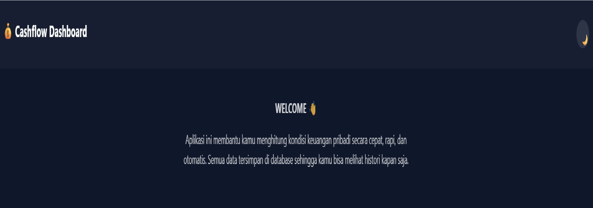
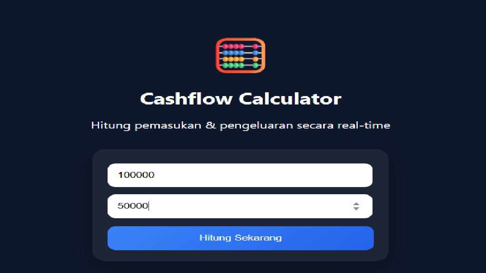
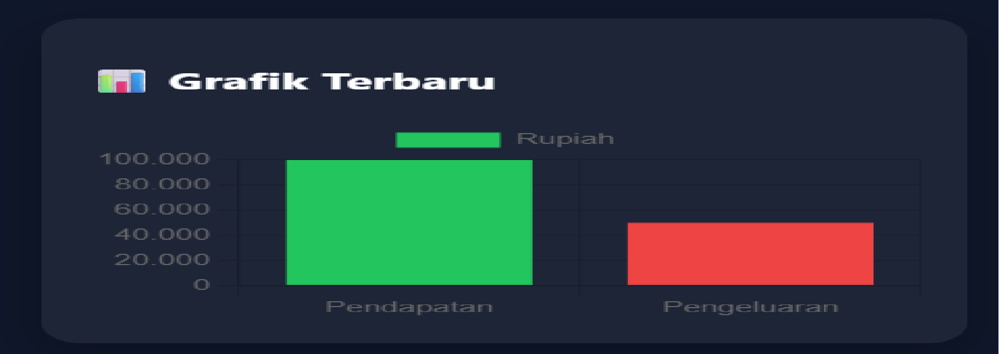

# 💰 Cashflow Calculator Web App

## Deskripsi
Aplikasi ini adalah web berbasis Python (Flask) yang digunakan untuk menghitung cashflow (selisih antara pendapatan dan pengeluaran). Aplikasi ini juga dapat menentukan kondisi keuangan serta menyimpan riwayat transaksi dan menampilkannya dalam bentuk grafik.

---

# PENJELASAN PYTHON (app.py)
## Jenis Program
- Web Application (Flask)
- Data Processing
- Database (SQLite)

## Proses utama:
1. User membuka website
2. User mengisi form (pendapatan & pengeluaran)
3. Data dikirim ke Python menggunakan method POST
4. Program melakukan perhitungan:
  hasil = pendapatan - pengeluaran
5. Program menentukan status:
   - Surplus (jika hasil > 0)
   - Defisit (jika hasil < 0)
   - Seimbang (jika hasil = 0)
6. Data disimpan ke database SQLite
7. Data dikirim kembali ke HTML untuk ditampilkan

## Buka di browser
http://127.0.0.1:5000

## 📸 Screenshot

### Halaman Welcome


### Form Input


### Hasil Perhitungan


### Grafik



---

## Cara Kerja Kode Python
Program menggunakan Flask untuk menjalankan server web dan memproses input dari user.
## Contoh
```python
@app.route("/", methods=["GET", "POST"])
def index():
    hasil = None
    status = None

    if request.method == "POST":
        pendapatan = float(request.form["pendapatan"])
        pengeluaran = float(request.form["pengeluaran"])

        hasil = pendapatan - pengeluaran

        if hasil > 0:
            status = "surplus"
        elif hasil < 0:
            status = "defisit"
        else:
            status = "imbang"

Penjelasan:
1. @app.route("/", methods=["GET", "POST"])
  Ini adalah route Flask
Artinya:
/ = halaman utama website
GET = saat user membuka web
POST = saat user kirim data (klik tombol hitung)

2. def index():
  Ini adalah function utama
Semua proses:
-ambil input
-hitung
-tentukan hasil terjadi di sini

3. hasil = None & status = None
Ini variabel awal
Fungsinya:
biar tidak error saat pertama kali halaman dibuka karena belum ada input dari user

4. if request.method == "POST":
Ini kondisi penting. Artinya:
Kode di dalamnya hanya jalan kalau:
➡ user menekan tombol Hitung
Kalau cuma buka web → tidak jalan

5. Ambil data dari form
pendapatan = float(request.form["pendapatan"])
pengeluaran = float(request.form["pengeluaran"])
Ini mengambil input dari HTML
Cara kerja:
-request.form = data dari form
-"pendapatan" = name di input HTML
-float() = ubah jadi angka

6. Proses perhitungan
hasil = pendapatan - pengeluaran
Ini inti kalkulator
Artinya:
kalau positif → untung
kalau negatif → rugi

7. Penentuan status
if hasil > 0:
    status = "surplus"
elif hasil < 0:
    status = "defisit"
else:
    status = "imbang"

Ini pakai percabangan (if-elif-else)
Cara kerja:
> 0 → surplus (uang lebih)
< 0 → defisit (rugi)
= 0 → seimbang

## OUTPUT PROGRAM
Output yang dihasilkan:
Nilai cashflow (angka hasil perhitungan)
Status keuangan:
-Surplus 💚
-Defisit ❤️
-Seimbang 💛
-Riwayat transaksi
-Grafik pendapatan vs pengeluaran


## Developer

Fridolin Joice Padandi  
Bisnis Digital